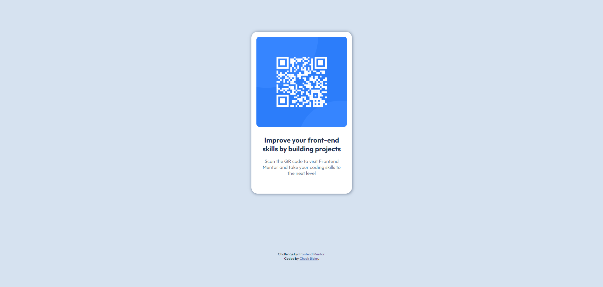

## Table of contents

- [Overview](#overview)
  - [Screenshot](#screenshot)
  - [Links](#links)
- [My process](#my-process)
  - [Built with](#built-with)
- [Author](#author)

## Overview

Hello there 😎.
This is my solution to the Frontend Mentor QR Code challenge.
The code is in HTML and CSS only.

### Screenshot

### Links

- Solution URL: [Add solution URL here](https://your-solution-url.com)
- Live Site URL: [Add live site URL here](https://chuck94ita.github.io/qr-code/)

## My process

I first created the base structure in HTML.
After that i focused on the CSS styling and refinished the details thanks to the Figma projects.

### Built with

- Semantic HTML5 markup
- CSS custom properties
- CSS Grid

## Author

- GitHub - [Add your name here](https://github.com/Chuck94ita)
- Frontend Mentor - [@yourusername](https://www.frontendmentor.io/profile/Chuck94ita)